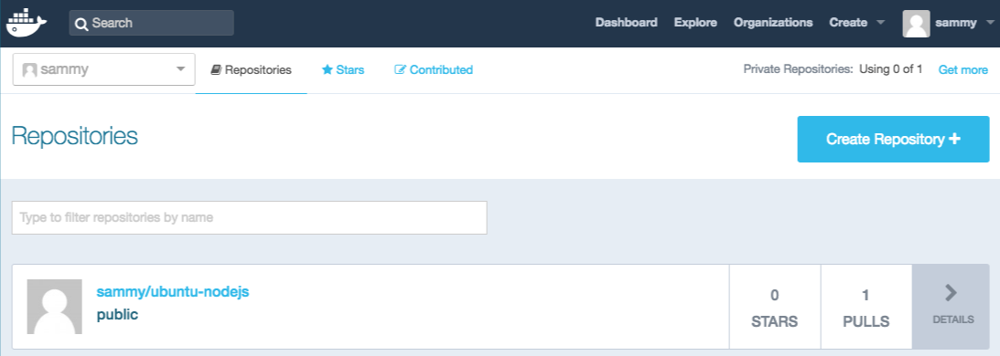

---
tags:
  - DOCKER
  - TUTORIAL
---

# Step 8—Pushing Docker Images to a Docker Repository

The next logical step after creating a new image from an existing image is to share it with a select few of your friends, the whole world on Docker Hub, or other Docker registry that you have access to. To push an image to [Docker Hub] or any other Docker registry, you must have an account there.

To push your image, first log into [Docker Hub].

``` sh
docker login -u docker-registry-username
```

You’ll be prompted to authenticate using your Docker Hub password. If you specified the correct password, authentication should succeed.

???+ note
    If your Docker registry username is different from the local username you used to create the image, you will have to tag your image with your registry username.

For the example given in the last step, you would type:

```sh
    docker tag sammy/ubuntu-nodejs docker-registry-username/ubuntu-nodejs
```

Then you may push your own image using:

``` sh
docker push docker-registry-username/docker-image-name
```

To push the ubuntu-nodejs image to the sammy repository, the command would be:

``` sh
docker push sammy/ubuntu-nodejs
```

The process may take some time to complete as it uploads the images, but when completed, the output will look like this:

``` sh title="Output"
The push refers to a repository [docker.io/sammy/ubuntu-nodejs]
e3fbbfb44187: Pushed
5f70bf18a086: Pushed
a3b5c80a4eba: Pushed
7f18b442972b: Pushed
3ce512daaf78: Pushed
7aae4540b42d: Pushed

...
```

After pushing an image to a registry, it should be listed on your account’s dashboard, like that show in the image below.



If a push attempt results in an error of this sort, then you likely did not log in:

``` yml title="Output"
The push refers to a repository [docker.io/sammy/ubuntu-nodejs]
e3fbbfb44187: Preparing
5f70bf18a086: Preparing
a3b5c80a4eba: Preparing
7f18b442972b: Preparing
3ce512daaf78: Preparing
7aae4540b42d: Waiting
unauthorized: authentication required
```

Log in with docker login and repeat the push attempt. Then verify that it exists on your Docker Hub repository page.

You can now use `#!shell docker pull sammy/ubuntu-nodejs` to pull the image to a new machine and use it to run a new container.

## Conclusion

In this tutorial you installed `Docker`, worked with images and containers, and pushed a modified image to Docker Hub. Now that you know the basics, explore the other Docker tutorials in the [DigitalOcean Community].

  [DigitalOcean Community]: https://www.digitalocean.com/community/tags/docker?type=tutorials

  [Docker Hub]: https://hub.docker.com/
